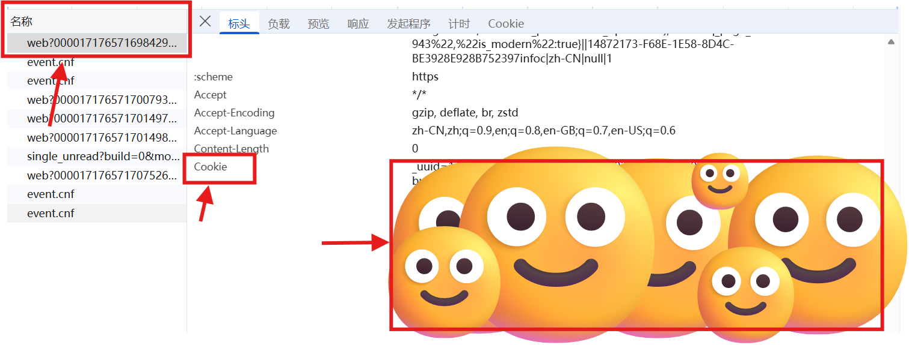

# Bilibili_search_data_Analysis_based_on_Python
基于 Python 的 B 站搜索数据分析

## Getting Start

### bili_search_scraper.py

爬取 B 站搜索数据内容的脚本为 `bili_search_scraper.py`。

用户可以根据自己的需求自行更改以下参数运行脚本，找到脚本最下面 `main` 中：

```python
if __name__ == "__main__":
    # ====== 手动修改搜索关键词 ======
    keyword = "Python" # 搜索关键词
    pages = 3 # 爬取页数
    out = f"{keyword}_搜索.csv" # 输出的文件名
    page_size = 30 # 每页数量（默认30）
    proxy = None # 如不使用代理，设为 None

    cookie = load_cookie(None)
```

- `keyword`：搜索关键词
- `pages`：爬取页数
- `out`：输出的文件名
- `page_size`：每页数量（默认30）
- `proxy`：如不使用代理，设为 None
- `cookie`：注意用户需要自行将自己运行 B 站时浏览器的 Cookie 保存到 `cookie.txt` 中，否则无法运行脚本。【具体的方法参考下文】

#### cookie.txt

首先在浏览器登陆 B 站，在 B 站的随便一个网页中右键 -> 检查，点击右上角的网络图标。


随便选择一个名称里的元素，在标头中往下找到一个叫 Cookie 的变量，复制右边的值。【注意这个值关系到个人账号的隐私，不要外传给他人】

在 `bili_search_scraper.py` 的同一路径下，新建一个文本文件，名字一定要叫 `cookie.txt`，将复制的 Cookie 值粘贴到 cookie.txt 中。


